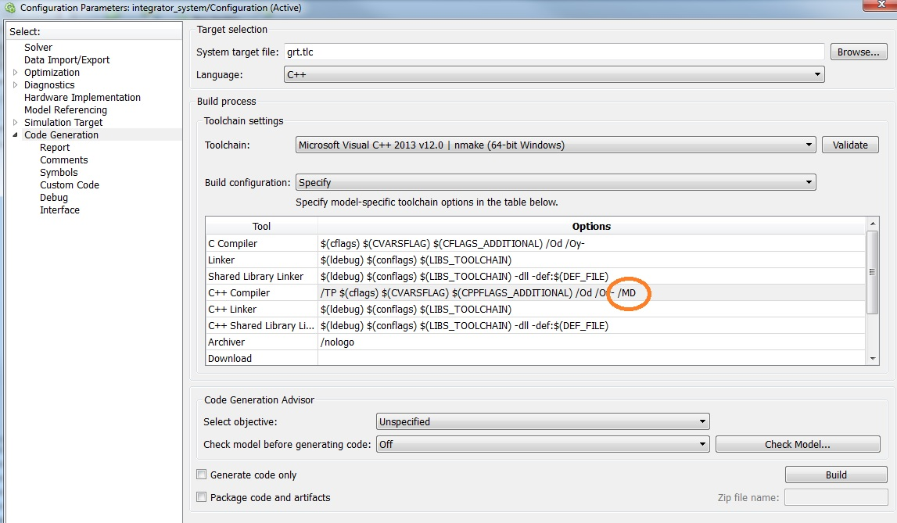

Matlab Interface				{#matlab-interface}
================

The following instructions give you an introduction on how to interface this package
with Matlab and Matlab Simulink. The procedure is still experimental,
please inform us about bugs and/or possible solutions.

Way 1: Compile MEX and S-Function wrapper using CMAKE
-----------------------------------------------------

Advantages: 
- Simple solution
- Allows the library *teb_package.lib* to be compiled either in Debug or Release mode

Disadvantages:
- In order to use the wrappers within *Matlab's/Simulink's RealTime Workshop*, the code 
  must be compilable with Matlab. In this case refer to *Way 2* instead.

You can directly include MEX or S-Function wrapper functions
(defined in separate *.cpp files) into the CMAKE build progress.
See the *CMakeLists.txt* for examples.

If the projects are stored in the example folder, add them to:

     SET(MEX_EXAMPLE_NAMES # matlab mex example files
		matlab_interface/integrator_system_mex	
		# Add files without .cpp extension here, attach folder name as a prefix
     )

     SET(SFUN_EXAMPLE_NAMES # matlab simulink mex example files
		matlab_interface/integrator_system_sfun
		# Add files without .cpp extension here, attach folder name as a prefix
     )

If you use a separate project, add them using ADD_MEX_FILE macro (see *cmake/macros* directory)
and link against the *teb_library.lib*. You need to include Matlabs source and libs
(see *FindMatlab.cmake* in *cmake/modules* and its application in *CMakeLists.txt*).

For information about the MEX wrapper source and the S-Function wrapper source themselves,
please refer to the example section.

The TEB library *teb_package.lib* and the compiled MEX files are stored somewhere inside the build folder, depending on the platform used.
Please check *build/bin/lib* and */build/lib/* first.

  
Way 2: Compile MEX and S-Function wrapper using Matlab itself
-------------------------------------------------------------

Advantages: 
- Avoids copying the MEX file from the build path to the working directory, since Matlab creates 
  it directly in the current directory.
- Allows compiling with *Matlab's/Simulink's Realtime Workshop*

Disadvantages:
- Allows the library *teb_package.lib* to be compiled only in Release mode.
- A second independent build process needs to be specified that requires information about libraries,
  include directories and additional source files.

Choosing this way requires the user to define settings for compiling a MEX wrapper in Matlab.
First make sure to have at least *Visual Studio 2013* installed.
Check if you set up your compiler in Matlab correctly:

    mex -setup
	
Now switch to your working directory containing the MEX wrapper source file
(For the sake of simplicity, we assume that additional header files are stored in the same folder, otherwise
add the corresponding path to build process).

Compile your source code using *mex '-IC:\\path-to-include' '-LC:\\path-to-library' '-lLibName' 'source-file-name.cpp'*.
If you want to use variables, use the following syntax and exchange the strings with variables:
     
     mex(['-I' 'C:\teb_package\include'],...            // add project include dir
		 ['-I' 'C:\teb_package\extern\eigen3'],...      // add path to Eigen-lib headers
		 ['-L' 'C:\teb_package\build\lib\Release'],...  // path to the package library teb_package.lib
		 ['-l' 'teb_package'],...				        // the filename of the lib (without extension)
		 'integrator_system_mex.cpp');  	            // Source file for the MEX or S-Function wrapper.
		 
If everything was successful you should now see a compiled MEX-file in your working directory.
Please refer to the example section for more details on how to use the MEX/S-Function interface.

**Use your code in Simulink**

Create your model and add the S-Function block where you can specify the name of your compiled MEX S-Function.
You can use your model in *Simulink Normal Mode* without Compiling

**Compile your code in Simulink**

If you want to compile your code in Simulink,
go to *Simulation/Model Configuration Paramters/Code Generation* and switch the Language to C++.
Select the *Interface* subsection and deselect *MAT-file logging*.
Finally, you need to provide all build informations that was required by the mex compiler.
Goto the *Custom Code* subsection.
In the fragment *Include list of additional* add all paths and files that are required (find here the integrator example):
- Include directories: \n
  *C:\\teb_package\\include* \n
  *C:\\teb_package\\extern\\eigen3* \n
- Libraries: \n
  *C:\\teb_package\\build\\lib\\Release\\teb_package.lib*

Instead of linking the *teb_package.lib*, you can add the C++ source files (e.g. to avoid *error LNK2038* (see below))
of the package directly:
- Source files:
	*C:\\teb_package\\src\\base\\base_controller.cpp* \n
	*C:\\teb_package\\src\\base\\base_solver_least_squares.cpp* \n
	*C:\\teb_package\\src\\base\\workspaces.cpp* \n
	*C:\\teb_package\\src\\solver\\solver_levenbergmarquardt_eigen_dense.cpp* \n
	*C:\\teb_package\\src\\solver\\solver_levenbergmarquardt_eigen_sparse.cpp* \n

Now you can compile your code directly within Simulink.
If you have any troubles, please check the *Troubleshooting* section first.

**Compile your code for Simulink xPC Target**

Go to *Simulation/Model Configuration Paramters/Code Generation* and change the target to *Simulink Real-Time*.
Afterwards follow the steps mentioned in *Compile your code in Simulink* above. But use the source files method instead
of linking the precompiled library *teb_package.lib* before.

Simulink xPC Target does not support IO. Therefore you have to define *RTW* before compiling the teb_package / model.
Define it using the CXX Flag *-DRTW* or uncomment the line `#define RTW' in the file *typedefs.h*.

Now you can compile you should be able to compile your model for xPC target.

**Compile your code for Simulink Real-Time Windows Target**

Compilation for RTWIN is currently only supported in *Normal Mode*.
Compiling in *External Mode* invokes a dedicated Real-Time Kernel that does not support dynamic memory allocation and exceptions.
Those are both utilized in the C++ standard library (STL) which is widely used within this project.
  
Troubleshooting
---------------  

- *error LNK2038: mismatch detected for '_ITERATOR_DEBUG_LEVEL': value '2' doesn't match value '0'* \n
  Try to compile the TEB package in Release mode: Check first lines in *CMakeLists.txt*!
  
  
- *error LNK2038: Konflikt ermittelt für "RuntimeLibrary": Der Wert "MD_DynamicRelease" stimmt nicht mit dem Wert "MT_StaticRelease" xxx_sfun.obj überein.*   \n
  Simulink compiles determines that some parts are compiled as static and some other parts as dynamic, therefore the linker cannot link
  them. For me it remains unclear, since the teb_package.lib is compiled statically and the mex compiler is Visual Studio in both cases.
  You can bypass this error by modifying the compiler settings in *Simulation/Model Configuration Paramters/Code Generation*
  by changing the *Build configuration* to *Specify* and append the */MD* flag to the C++ Compiler flags. If you have still problems,
  try to exchange /*MD* with */MT*.
  See the image below:
  
  An alternative way to solve the problem is to directly compile the whole teb_package by providing the *.cpp source files instead of the library *teb_package.lib*.
